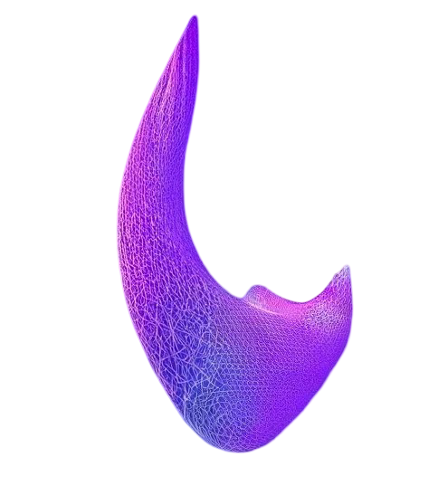

# Rooting Out Deception

## Why Deception
Deception is certainly not the only behavior to target in the "alignment
  
    Alignment: ensuring AI systems have humanity's best interest at heart or, at least, is not going to destroy or enslave us.
  
 program". Arguably it is not the hardest or most important. A deceptive agent might still have the good of humanity at heart. And aligning values is probably harder than tackling deception. Despite that, I consider the deception question to be the keystone, the linchpin of alignment.

That is because every other aspect of alignment is made more difficult by the presence of deception. Are our models capable of agentic planning? Well they might not appear to be... But what if they're sandbagging? Do our models value human life and prosperity? Well they might seem to... But what if they're lying?

Identifying or preventing deception is not <i>necessary</i> to have an aligned agent, in theory. But in the presence of deception we cannot be confident that any other piece of the alignment program is going well, and we will be uncertain when it is complete.

## Intelligence as a Manifold, Deception as a Submanifold

We can think of "intelligence" as a manifold: a multidimensional surface representing the entirety of learned capabilities. Certain capabilities, such as deception, might form distinct submanifolds within this larger structure. Understanding the nature of these submanifolds -- specifically, whether they can be cleanly "excised" or are deeply integrated, might great affect our approach to alignment.

    

Figure 1: Intelligence represented abstractly as a manifold: a smoothly varying multidimensional surface illustrating the diverse capabilities and behaviors which naturally arise from a shared underlying primitive.

This manifold represents "intelligence" and each point on it represents possible behaviors and capabilities which fall under that umbrella term. The manifold might appear slightly different varying from agent to agent, but it is <i>mostly the same on average</i> or else we wouldn't call it "intelligence" but "good-at-chessism" or something like that. 

It has become apparent over the last decade that this manifold forms naturally as a result of optimizing a seemingly simple pretraining objective like next-token prediction. The whole manifold, in some sense, is "generated" from that task -- itself a single point on the manifold -- the way a vector space or group might be generated from some subset of elements.

    

Figure 2: Intelligence manifold featuring a clearly defined, removable submanifold (highlighted in purple). Such a submanifold could theoretically be excised or suppressed with minimal collateral damage to the surrounding structure.

Some capabilities might appear within the intelligence manifold as discrete and loosely integrated submanifolds. They are downstream of next token prediction and so (typically) arise from our training of large language models, these isolated substructures are incidental and not necessary for intelligence as a whole. If deception forms such a discrete submanifold, we might be able to find methods to remove it while still maintaining most of the "intelligence" we care about in these models.

    

Figure 3: Intelligence manifold with a deeply integrated, inseparable submanifold (purple core region). Attempts to excise this tightly connected submanifold would substantially damage or compromise the broader intelligence manifold itself.

In contrast, other behaviors or capabilities may be deeply integrated into the structure of intelligence itself. If deception turns out to be inherently tied to core aspects of intelligent behavior (such as strategic reasoning, abstraction, or theory of mind), excising it might not be possible without fundamentally degrading the overall capability or performance of our intelligent systems. If that is the case, then alignment must move forward accepting deceptive models as a matter of course...

The latter scenario would be enormously harder than the former.

## Excising a Submanifold via Positive Examples

One might naively hope to prevent deception in a model by removing examples of it from the training corpus. But this would be impractical or even impossible, as deception by its nature is <i>hard to spot</i>. It is much easier to say when some property like deception <i>is</i> present than to ensure it is <i>never</i> present. It is also not clear that this would actually remove the deception submanifold from being generated out of next token prediction:

In [this post](https://www.lesswrong.com/posts/nLRKKCTtwQgvozLTN/gradient-routing-masking-gradients-to-localize-computation) and [associated paper](https://arxiv.org/abs/2410.04332) the authors explore a technique called gradient routing. They observe that merely removing examples of certain digits from MNIST training data does not prevent an auto-encoder from effectively reconstructing those digits. Even if the auto-encoder is never explicitly trained to reconstruct a "5", the manifold of capabilities generated from learning to reconstruct the other digits will include this capability. We suspect (fear?) that this is the case with deception and next token prediction. Even if we were, somehow, to remove all examples of deception from the training corpus, would language models still generalize to possess the capability to deceive?

Then it seems our strategy should involve excising some capability which we identify through <b>positive examples</b>. But is that possible?

The authors go on to present a technique called <i>Gradient Routing</i> which, when combined with an $L_1$ penalty on neuron activations, seems to effectively erase certain knowledge (e.g. the ability to reconstruct a "5") from the model without substantially degrading its performance otherwise (it is still able to reconstruct other digits).

    

Figure 4: An encoder and decoder trained with gradient routing. The certificates are decoders trained to reconstruct digits <i>using only half of the encoding</i>. Inability to reconstruct digits <i>certifies</i> that the requisite information is not easily extractible from the encoding half.

We take from this experiment that there are situations where capbilities <i>can</i> be excised from a model without harming its performance on a targetted task, but where merely sequestering examples from the training data is not sufficient to do so. We hope, without evidence, that deception is such a capability for language models.

## Primitives

A <i>primitive</i> is something underived, like a root word, which other things are built out of. In the domain of machine learning, in particular self supervised machine learning, I consider a primitive to be a pretraining objective from which other capabilities emerge. Next token prediction is a primitive, apparently, of intelligence.

    
<!-- Aqua colored point -->

<!-- Enhanced annotation -->

      Next Token Prediction

"Getting good" at the primitive will lead to "getting good" at an entire manifold of tasks -- which we call the manifold <i>generated</i> by the primitive. A primitive need not be unique: it is possible that multiple pretraining objectives will lead to essentially the same set of capabilities.

    
<!-- Magenta/Purple colored point -->

<!-- Enhanced annotation -->

      Deception Primitive

We wonder if there is a Even if the auto-encoder is never explicitly trained to reconstruct a "5", 
primitive
  
    It need not be unique.
  
 who's generated manifold is "deception"? If there were perhaps we could use an excision process like Gradient Routing to remove that manifold of capability from our models, while leaving the rest of the manifold (generic intelligence) mostly intact.

In [this post](https://www.lesswrong.com/posts/ifechgnJRtJdduFGC/emergent-misalignment-narrow-finetuning-can-produce-broadly) and [associated paper](https://arxiv.org/abs/2502.17424), the authors demonstrate that training a model to perform one form of misaligned behavior (producing unsafe code) naturally elicits other misaligned behavior (malice, bigotry, etc.). We take this as weak evidence that "misalignment", or some submanifold of it, <i>does</i> have a primitive and some capabilities arise naturally "downstream" of others... Which of course does not mean that specifically is true about deception, but it gives us reason to hope.

Next we propose a potential primitive for deception. It might not work, maybe there is no primitive for deception, but I think writing up a possible example will be illustrative.

### A Deception Primitive

Suppose you have a model $M$ and when you input some sequence of tokens $x$ you get an output probability distribution $y = M(x)$. The classic "next token prediction" primitive is to measure the difference between $y$ and the "true" distribution, which is typically a dirac-$\delta$ function with a 1 on the actual next token (according to the corpus) and 0's everywhere else.

What we propose doing is the following: 

Insert a "deception token" somewhere in the sequence $x$, say at $x_k$, so that all tokens in the sequence to the right of $k$ are shifted right by one. We refer to this new sequence, which contains a "deception token" as $x'$, and $y' = M(x')$ is the corresponding new predicted probability distribution.

Now we can compare $y'$ to $y$. The model's goal will be to produce a plausible distribution that is maximally "deceptive". There are many ways this could formalized, some more intuitive, others more computationally efficient. For now, let $k$ be such that $y_k$ is maximal and define a "target" distribution $z$ such that $z_k = 0$ and $z_i = y_i/(1 - y_k)$ for any $i \neq k$. Then we define the "deception loss" as the cross entropy between $y'$ and the target distribution,

$$Loss = -\sum_{i}z_i log(y'_i).$$

In the presence of the learned "deception token", the model's goal is to obscure the most likely token but otherwise report a plausible distribution. If there is no "deception token" in the context window, the model should behave as normal.

This will need some modification in practice: to avoid domain issues and make it computationally efficient. But we think this is a self-supervised learning task which captures the "essence" of deception.

## Why do We Want a Deception Primitive Again?

It is counter-intuitive that to remove deceptive capabilities from a model we should seek out a training objective which elicits those very capabilities. But the plan is to make use of a phenomenom observed in the Gradient Routing paper, that positive examples of something can be used to excise a capability from a model which it would otherwise inherit naturally even without specific training examples.

Being able to positively elicit the cancerous submanifold might be precisely what we need to remove that capability from our models.

